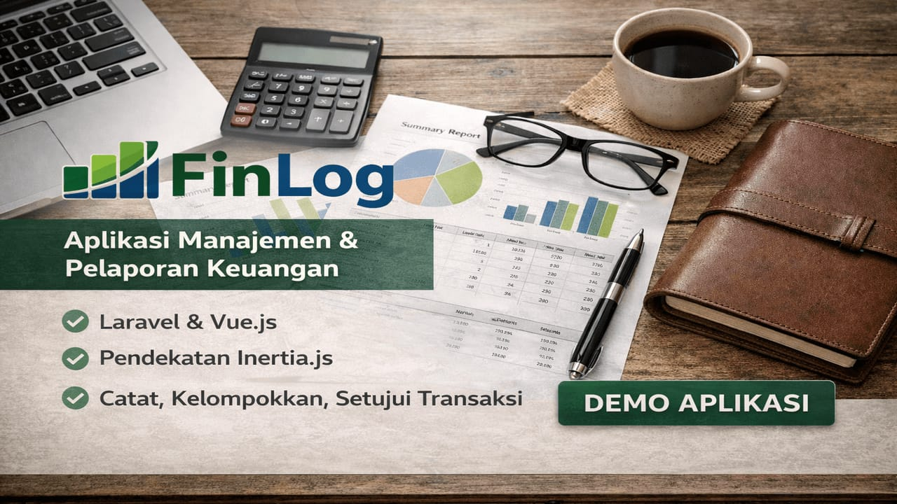
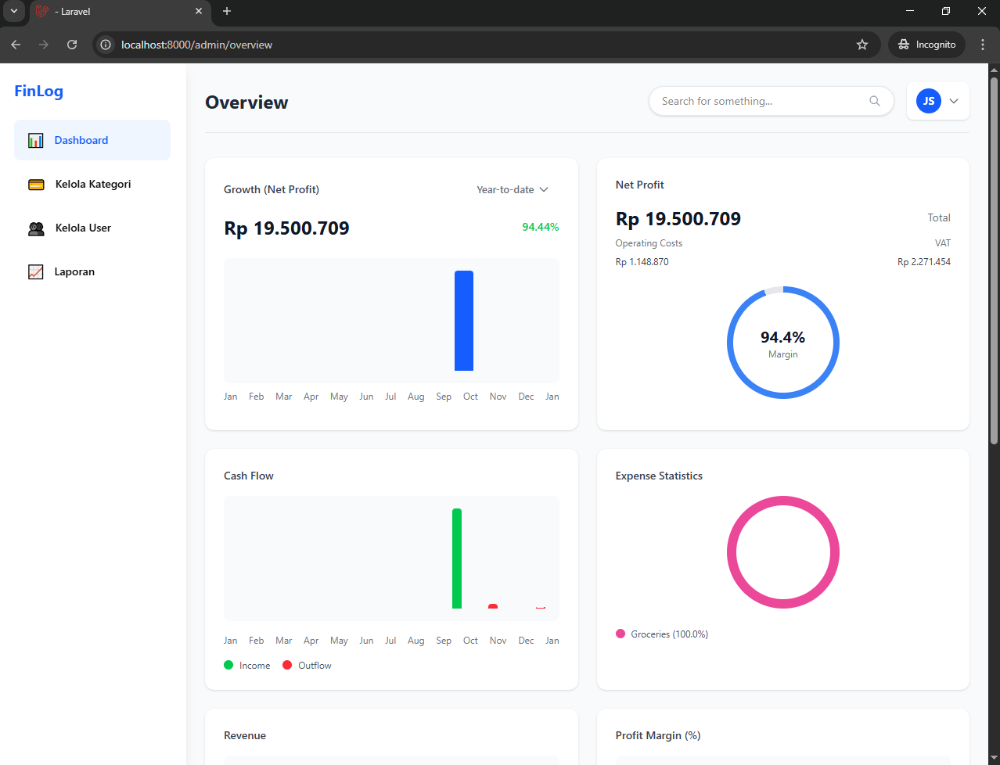
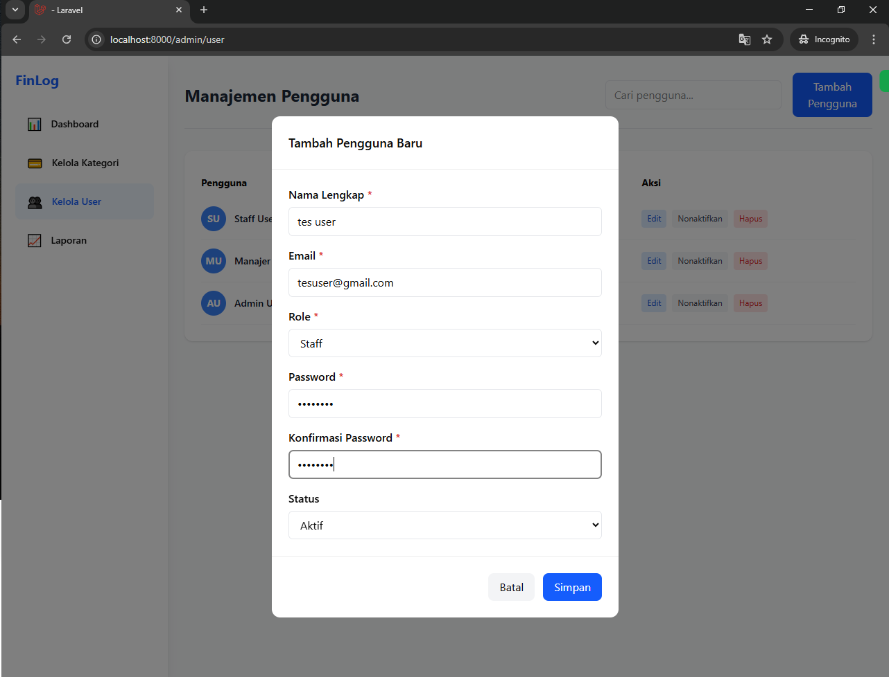
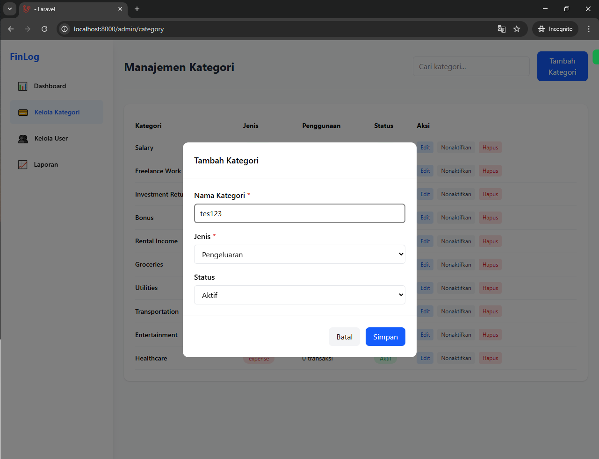
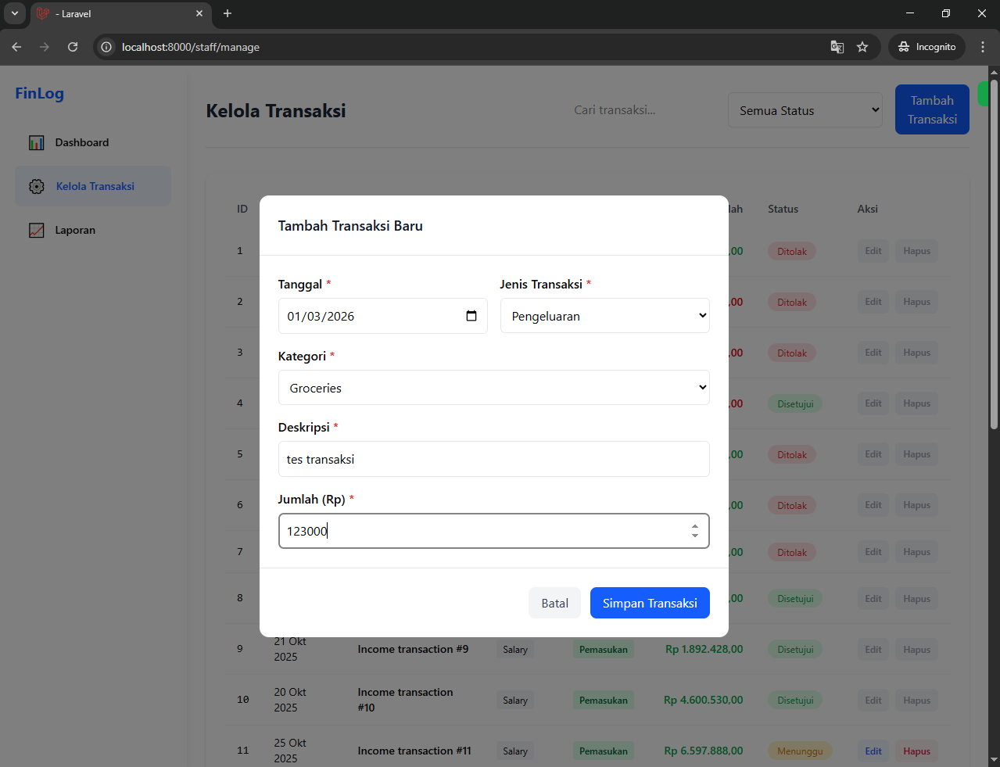
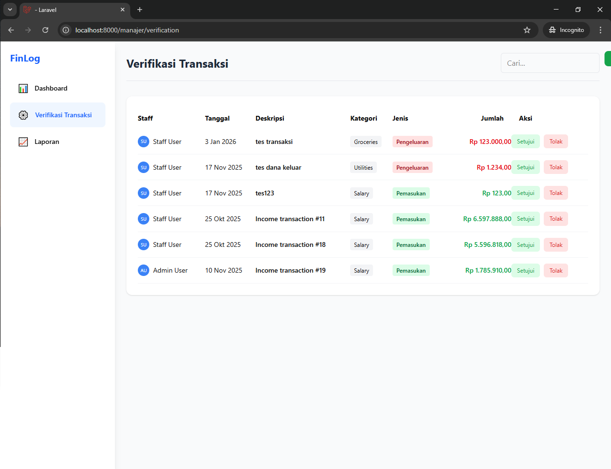
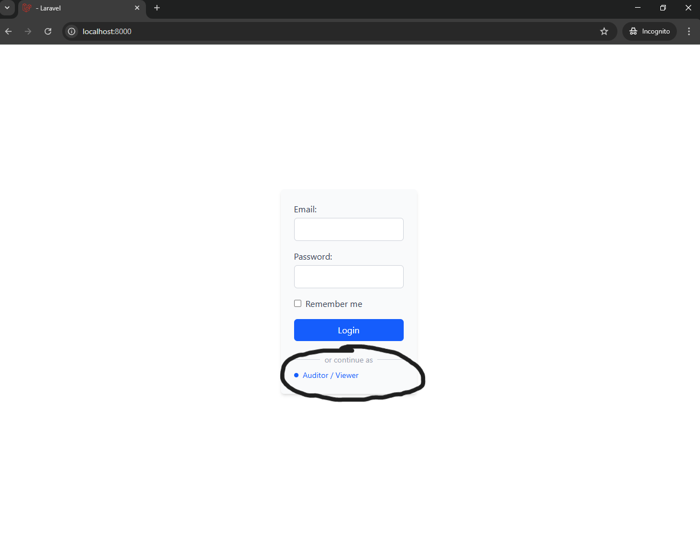
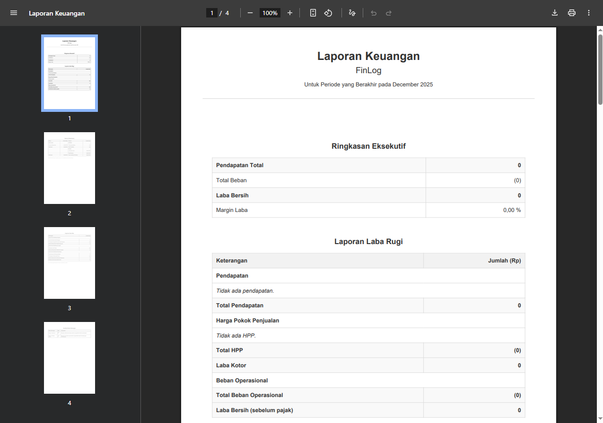
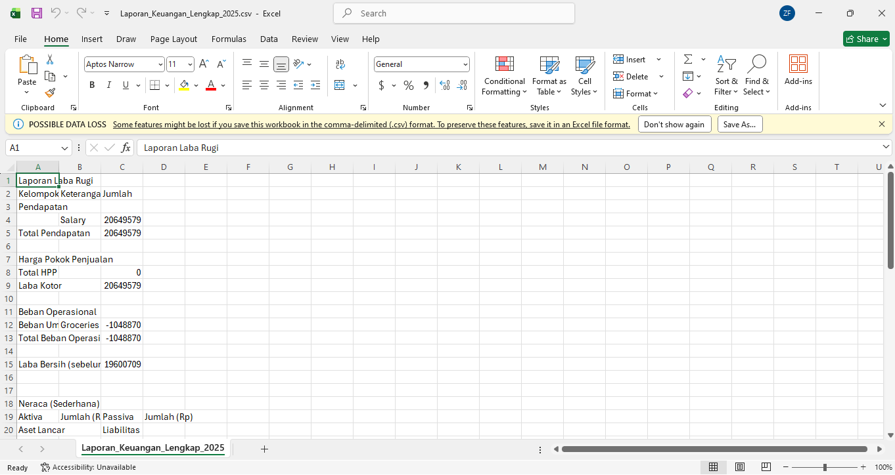

# FinLog – Financial Management & Approval System

<br>

<p align="center">
&nbsp&nbsp
&nbsp&nbsp
&nbsp&nbsp

</p>

<br>

FinLog adalah aplikasi web untuk manajemen dan pelaporan keuangan berbasis peran (Role-Based Access Control).  
Aplikasi ini mendukung pencatatan transaksi, pengelompokan kategori, serta alur persetujuan transaksi secara terstruktur.

FinLog dirancang menyerupai Single-Page Application (SPA) menggunakan Inertia.js, sehingga frontend Vue.js dan backend Laravel terintegrasi tanpa API REST terpisah.

[](https://www.youtube.com/watch?v=f-kvJPb8gmU)


## Live Demo (Deployment)

Aplikasi FinLog tersedia secara online untuk tujuan pengujian aplikasi secara langsung.

- **URL**: https://finlog-production.up.railway.app
- **Deployment Platform**: Railway
- **Masa aktif demo**: 10 januari 2026 - 9 februari 2026.

  <br>

> **credentials test (seeder):**
> 
>  **admin**:
> - email = `admin@gmail.com`
> - password = `password`
>
>  **staff**:
> - email = `staff@gmail.com`
> - password = `password`
> 
>  **manajer**:
> - email = `manajer@gmail.com`
> - password = `password`

<br>

> [!NOTE]
> **Auditor/Viewer**
> - tidak perlu email
> - tidak perlu password


<br>


## Tech Stack

### Backend
- Laravel 12
- MySQL
- Eloquent ORM

### Frontend
- Vue.js
- TypeScript
- Inertia.js
- Vite
- Tailwind CSS

## Fitur Utama

- Pencatatan transaksi keuangan
- Manajemen kategori (CRUD)
- Alur persetujuan transaksi (approve & reject)
- Manajemen pengguna berbasis peran:
  - Admin
  - Manajer
  - Staff
  - Viewer
- Pembatasan akses fitur menggunakan middleware
- Penanganan akses tidak sah (HTTP 403)
- Ekspor laporan ke PDF dan Excel

## Instalasi & Setup

```bash
git clone https://github.com/zplusplus0life/FinLog.git
cd FinLog

composer install
npm install

cp .env.example .env
php artisan key:generate
php artisan migrate

php artisan serve
npm run dev
```

Pastikan:
- PHP >= 8.2
- Node.js >= 24.10.0
- MySQL aktif dan terkonfigurasi di .env

## Arsitektur Aplikasi

Aplikasi menggunakan arsitektur MVC (Model–View–Controller) pada Laravel, dengan Inertia.js sebagai penghubung backend dan frontend.

### Struktur Direktori Utama

- **app/Http/Controllers** - Logika bisnis aplikasi
- **app/Models** - Representasi tabel database (Eloquent)
- **app/Http/Middleware** - Pembatasan akses berbasis peran
- **routes/web.php** - Routing aplikasi
- **resources/js/pages/** - Frontend Vue.js (pages, components, layouts)
- **docs/** - Dokumentasi visual dan diagram sistem

## Diagram Sistem

Diagram teknis tersedia di folder `docs/diagrams/`:
- Use Case Diagram
- Entity Relationship Diagram (ERD)
- Sequence Diagram (Approval Flow)
- Diagram Komponen Aplikasi

## Screenshots Aplikasi

### Admin – Dashboard & Manajemen Data





### Staff & Manajer – Transaksi & Approval




### Viewer & Ekspor Laporan





## Catatan Teknis

- RBAC diimplementasikan menggunakan middleware Laravel
- Tidak menggunakan API REST terpisah (Inertia.js)
- Validasi dilakukan di backend untuk menjaga konsistensi data
- Struktur kode dipisahkan berdasarkan tanggung jawab (clean MVC)

## Lisensi

Proyek ini dilisensikan di bawah [MIT License](LICENSE).

Dikembangkan sebagai bagian dari portofolio profesional, untuk mendemonstrasikan kemampuan dalam pengembangan aplikasi web full-stack dengan Laravel dan Vue.js.
